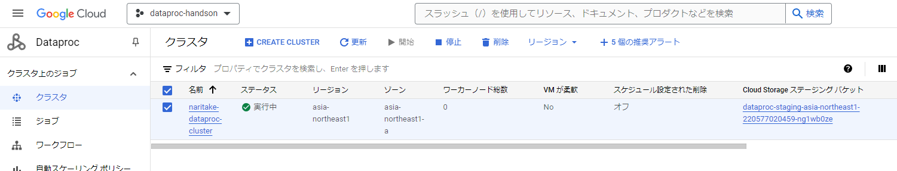
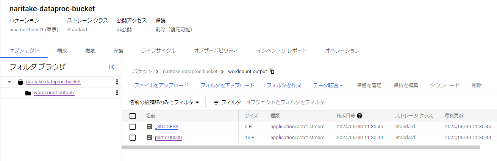

```
gcloud auth login
gcloud config set project {my-google-project}
```

## Dataprocクラスター生成
```
gcloud dataproc clusters create naritake-dataproc-cluster --region=asia-northeast1 --zone=asia-northeast1-a --single-node --master-machine-type=n2-standard-2 --master-boot-disk-size=30GB
```



## txtファイルをGCSに保存

```
gsutil cp hello-world.txt gs://naritake-dataproc-bucket/hello-world.txt
```

#### hello-world.txt
```
Hello World
```


## 指定したテキストの単語を数えるジョブを実行
- GCSバケットの`hello-world.txt`を解析し、その結果をGCSバケットに出力させる
- 解析対象のファイル指定に`gs://`から始まるURLを指定することで[Cloud Storageコネクタ](https://cloud.google.com/dataproc/docs/concepts/connectors/cloud-storage?hl=ja)を使うことができる
  - `hdfs://`から始まる指定だとHDFS(Hadoop Distributed File System)を使う
  - HDFSの場合はクラスタ内のストレージを使用することになる
    - HDFSはクラスタの破棄と同時に消える
- HDFSではなくGCS(=CloudStorageコネクタ)を使うことでDataprocクラスタにおけるコンピュートリソースとストレージを分離することができる
  - これによりDataprocクラスタは純粋なコンピュートリソースとして扱えるようになるので、ジョブが必要な時にクラスタを生成->ジョブが完了したらクラスタを破棄、という運用が可能になる(コストメリットが得られる)
  - このようなジョブ単位のクラスターはエフェメラルクラスターと呼ばれる

```
gcloud dataproc jobs submit hadoop --cluster=naritake-dataproc-cluster --region=asia-northeast1 --jar=file:///usr/lib/hadoop-mapreduce/hadoop-mapreduce-examples.jar -- wordcount gs://naritake-dataproc-bucket/hello-world.txt gs://naritake-dataproc-bucket/wordcount-outpu
t
```

## クラスターに実行させたジョブの結果を確認する
- 単語を数えた結果をGCSバケットに書き込ませている




#### wordcount-output_part-r-00000
```
Hello	1
World	1
```

## 不要になったDataprocクラスターを片付ける

```
gcloud dataproc clusters delete naritake-dataproc-cluster --region=asia-northeast1
```


## Sparkジョブとして実行させる
- 処理を実行するpythonコードを書く

```py
from pyspark.sql import SparkSession

spark = SparkSession.builder.appName("wordcount").getOrCreate()
text_file = spark.read.text("gs://naritake-dataproc-bucket/hello-world.txt")
words = text_file.selectExpr("split(value, ',') as words")
word_counts = words.rdd.flatMap(lambda x: x).countByValue()
for word, count in word_counts.items():
    print(f"{word}: {count}")
spark.stop()
```

- pythonコードをGCSバケットに保存しておく

```
gsutil cp wordcount.py gs://naritake-datap
roc-bucket/wordcount.py
```

- 予め作っておいたDataprocクラスターにSparkジョブの実行を指示する

```
gcloud dataproc jobs submit pyspark gs://naritake-dataproc-bucket/wordcount.py --cluster=naritake-dataproc-cluster --region=asia-northeast1
```